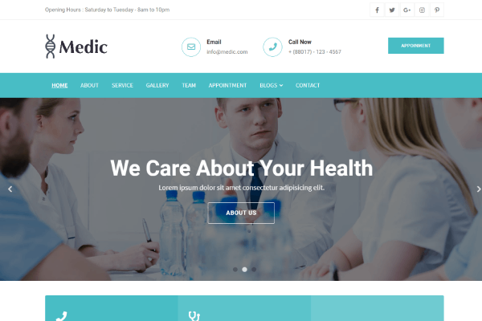
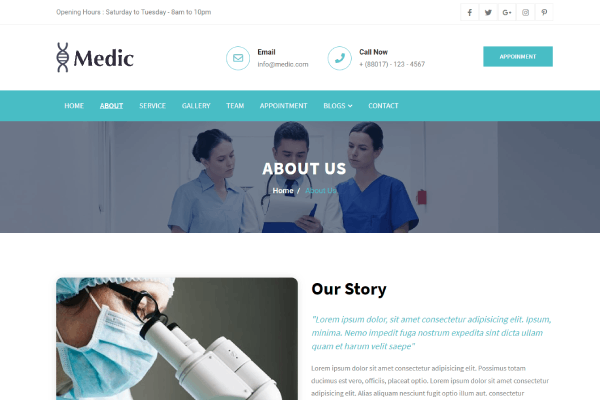
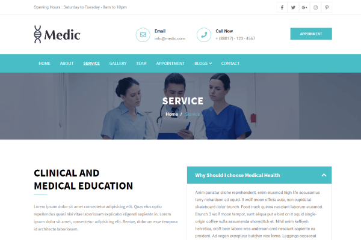
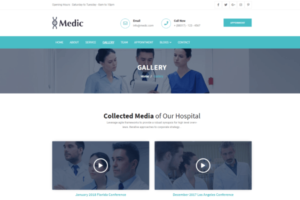
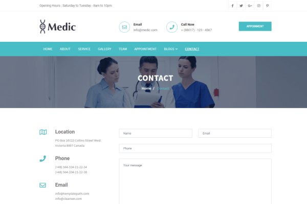

<!-- demonstração -->
## Site de exemplo

| [](https://demo.themefisher.com/themefisher/medic/index.html) | [](https://demo.themefisher.com/themefisher/medic/about.html) | [](https://demo.themefisher.com/themefisher/medic/service.html) |
|:---:|:---:|:---:|
| **Página inicial** | **Sobre** | **Serviço** |
| [](https://demo.themefisher.com/themefisher/medic/gallery.html) | [](https://demo.themefisher.com/themefisher/medic/team.html) | [](https://demo.themefisher.com/themefisher/medic/contact.html) |
| **Galeria** | **Equipe** | **Contato** |

👉🏻[Visualizar visualização ao vivo](https://demo.themefisher.com/themefisher/medic/)

<!-- páginas -->
## Páginas

* **Pagina inicial**
* **Sobre**
* **Serviços**
* **Galeria**
* **Equipe**
* **Compromisso**
* **Blog**
* **Detalhes do blog**
* **Contato**

<!-- baixar -->
## Download e instalação

Baixe este modelo do [Github](https://github.com/themefisher/medic/archive/main.zip)

<!-- instalação -->
### Usos básicos

Depois de baixar o modelo, você pode simplesmente editar os arquivos HTML e CSS da pasta `theme`. Para visualizar as alterações feitas no código, você pode abrir o arquivo index.html em seu navegador da web.

### Uso avançado

Para uso avançado, você tem alguns pré-requisitos para instalar. Então você pode executá-lo em seu localhost. Você pode visualizar o arquivo package.json para ver quais scripts estão incluídos.

#### Pré-requisitos de instalação (uma vez para uma máquina)

* **Instalação do nó:** [Instalar o nó js](https://nodejs.org/en/download/)
* **Instalação do Gulp:** Instale o gulp globalmente a partir do seu terminal

```
npm install --global gulp-cli
```

Ou visite os [documentos Gulp] originais (https://gulpjs.com/docs/en/getting-started/quick-start)

#### Configuração local

Depois de instalar com sucesso essas dependências, abra este tema com qualquer IDE [[VS Code](https://code.visualstudio.com/) recomendado] e, em seguida, abra o terminal interno do IDM [vs code atalho <code>ctrl/cmd+ \`</code>]

* Instalar dependências

```
npm instalar
```

* Executar localmente

```
npm executar dev
```

Depois disso, ele abrirá uma visualização do modelo em seu navegador padrão, observará as alterações nos arquivos de origem e recarregará o navegador ao vivo quando as alterações forem salvas.

#### Compilação de Produção

Depois de terminar toda a personalização, você pode criar uma compilação de produção executando este comando.

```
npm executar compilação
```

Agora você obtém uma pasta `theme` que contém todas as alterações que você fez. você pode usar esta pasta como seu tema principal.

👉🏻 [visite a documentação](https://docs.themefisher.com/medic/)

<!-- problema de relatório -->
## Problemas de relatório

Usamos os problemas do GitHub como o rastreador de bugs oficial para o modelo médico. Pesquise [problemas existentes](https://github.com/themefisher/medic/issues). É possível que alguém já tenha relatado o mesmo problema.
Se o seu problema ou ideia ainda não foi resolvido, sinta-se à vontade para [abrir um novo problema](https://github.com/themefisher/medic/issues).

<!-- suporte -->
## Suporte Técnico ou Dúvidas (Pago)

Se você tiver dúvidas ou precisar de ajuda para integrar o produto, [entre em contato conosco] (mailto:mehedi@themefisher.com) em vez de abrir um problema.

<!-- licença -->
## Licença

Copyright (c) 2016 - Presente, projetado e desenvolvido por [Themefisher](https://themefisher.com)

**Licença de código:** lançado sob a licença [MIT](https://github.com/themefisher/medic/blob/main/LICENSE).

**Licença de imagem:** As imagens são apenas para fins de demonstração. Eles têm sua licença, não temos permissão para compartilhar essas imagens.

<!-- recursos -->
## Recursos

Alguns plugins de terceiros que usamos para construir este modelo. Por favor, verifique sua licença.

* **Bootstrap v4.5**: <https://getbootstrap.com/docs/4.5/getting-started/introduction/>
* **Jquery v3.5.1**: <https://jquery.com/download/>
* **Google Fonts**: <http://fonts.google.com/>
* **Animar CSS**: <https://animate.style/>
* **Fancybox**: <http://fancybox.net/>
* **Fonte incrível grátis**: <https://fontawesome.com/>
* **jQueryUi**: <https://jqueryui.com/>
* **Seletor de tempo**: <http://pttimeselect.sourceforge.net/example/index.html>
* **Slick**: <https://kenwheeler.github.io/slick/>
